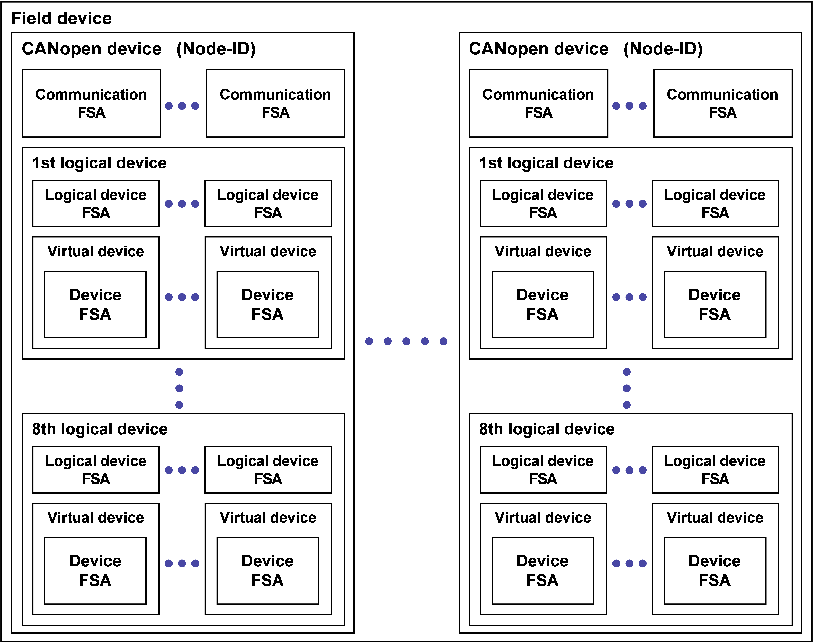
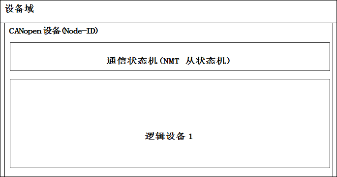
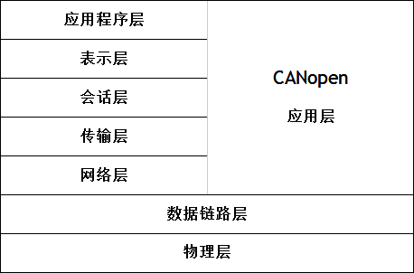
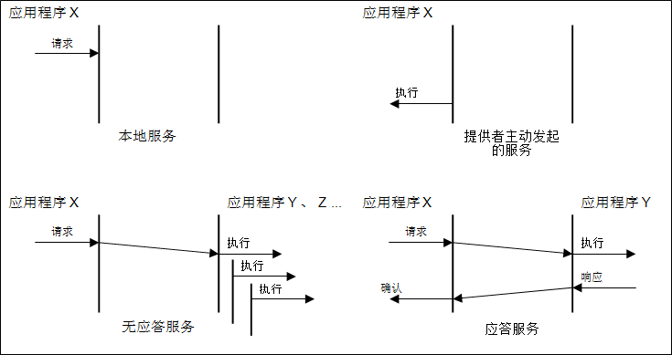
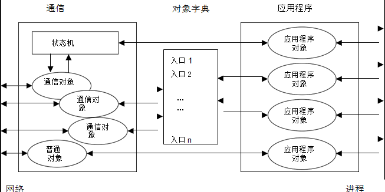

# 4. **建模**

## 4.1 **设备模型**

如图1所示，设备域至少包含一个CANopen设备。其中每个CANopen设备至少带有一个包含数据链路层(见本章第6节)和物理层(见本章第5节)的网络接口、一个node-ID、至少一种通信状态机(FSA)。通信状态机不仅带有NMT从状态机(见7.3.2)，还包括应急状态机(见7.2.7)等其他附加状态机。这些附加状态机定义于所谓的框架协议内，不属于本协议范围。一个CANopen设备至少包含一个多至8个逻辑设备，且不可分割于多个设备域。每个逻辑设备可包含一个逻辑设备状态机(可选)和多个虚拟设备。逻辑设备不可分割于多个CANopen设备。逻辑设备定义于所谓的设备协议中(见4.5.1)，不在本协议的范围内。每个虚拟设备包含一个虚拟设备状态机且不可分割于多个逻辑设备。虚拟设备定义于所谓的应用协议(请参阅4.5.2)，不在本协议范围内。设备域的最小化结构如图2所示。

图1：设备域模型

图2：最小化设备域
 
## 4.2 **通信参考模型**

### 4.2.1 **简述**

图3：通信参考模

通信概念符合ISO-OSI参考模型(图3左侧，见/ISO7498-1/)。

###4.2.2 **CANopen应用层**

####4.2.2.1	**概述**

应用层用来描述CANopen设备间配置和同步实时数据的机制。该功能在应用层中被分割为若干不同的逻辑服务对象。 服务对象提供特定的功能和所有相关的服务。在本协议的相关服务对象规范中进行具体描述。

通过调用应用层的服务对象接口来完成应用交互。协议提供的服务经由数据链路层实现交换数据。在本协议的服务对象相关协议规范中进行具体描述。

####4.2.2.2 **服务原语**

服务原语意指应用程序与应用程序之间交互。 有四种不同的原语：
* 应用程序发起到应用层的服务请求。
* 应用层向应用程序发送的通知，汇报一个应用层检测到的内部事件或者表明其收到一个服务请求。
* 应用程序为接收到的一个汇报向应用层做出应答。
* 应用层为收到应用程序的服务请求所作的响应确认。

####4.2.2.3 **应用层服务**

图4：应用层服务

应用层服务定义若干在和协同操作的应用程序间交换原语的特定服务对象。CANopen支持的应用层服务见图4所示。
* 本地服务只涉及本地的服务对象。应用程序向本地服务对象发出请求，执行请求的服务对象在本地，而并不与远程对应的服务对象产生通信行为。
* 发起的服务只涉及本地的服务对象。服务对象(即服务提供者)检测到一个事件但该事件并非一个请求服务。事件被通报给应用程序。
* 一次无应答服务涉及一个或多个对等服务对象。应用程序向本地服务对象发出一个请求。此请求将被传送到远程对应的服务对象，每个对应服务对象都会将请求作为一个操作行为传递给所属应用程序。处理结果不返回。
* 一次带应答服务只涉及远程对应的服务对象。应用程序向本地服务对象发出一个请求。此请求将传送到对应的远程服务对象, 对应的服务对象将其作为一个操作行为传递给所属应用程序。其产生应答回传给请求方应用程序。

无应答服务和应答服务统称为远程服务。

##4.3 **CANopen设备模型**

###4.3.1 **简述**

CANopen 设备的结构如下(图5所示)：
* 通信–此功能单元提供通信对象和与之相应的通过底层网络结构传输数据的能力。
* 对象字典–对象字典集合了设备上所有影响应用程序对象、通信对象和状态机行为的数据项。
* 应用程序 - 应用程序包括与过程环境能够产生相互作用的设备功能。(译者注：这里的应用程序仅只参与通信过程，会对网络其他设备造成影响的关联设备功能实现)

因此，对象字典是通信对象和应用程序对象之间的接口。（译者注：理解这一点很重要）

图5：CANopen设备模型

##4.4 **通信协议分类**

###4.4.1 **简述**

通信协议分类描述不同通信协议的原则和消息传输触发的可用模式。

CANopen 通信协议支持同步和事件驱动的消息传输。通过同步传输使得网络范围内的协同数据采集和动作输出成为可能。同步传输依赖于预定义通信对象（译者注：主要是指支持预定义连接集的PDO）。同步传输遵循预定义的同步消息机制、事件驱动的消息传输可以在任何时间发起。

事件性质通信机制的基本属性要求定义通信的抑制时间。为保证网络上的低优先级通信对象不被饿死, 需要为通信对象设计抑制时间。即将通信对象定义两次传输服务间的最小时间间隔作为抑制时间。

就其功能，归纳出三种类型的通信协议模型
* 主/从协议(见4.4.2)
* 客户端/服务器协议(见4.4.3)
* 生产者/消费者协议(见4.4.4)

###4.4.2 **主/从协议**

任意时刻CANopen网络中都仅存在一个设备以主设备身份执行特定功能。CANopen网络中所有其他的设备均为从设备。按协议规定，主设备会向被寻址从设备（们）发送请求，从设备（们）响应。图6定义了无应答的主/从协议模式。图7定义了带应答的主/从协议模式。

[页首](#jump)
