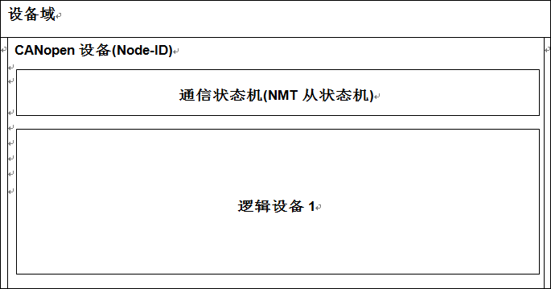

# 4. **建模**

## 4.1 **设备模型**

如图1所示，设备域至少包含一个CANopen设备。其中每个CANopen设备至少带有一个包含数据链路层(见本章第6节)和物理层(见本章第5节)的网络接口、一个node-ID、至少一种通信状态机(FSA)。通信状态机不仅带有NMT从状态机(见7.3.2)，还包括应急状态机(见7.2.7)等其他附加状态机。这些附加状态机定义于所谓的框架协议内，不属于本协议范围。一个CANopen设备至少包含一个多至8个逻辑设备，且不可分割于多个设备域。每个逻辑设备可包含一个逻辑设备状态机(可选)和多个虚拟设备。逻辑设备不可分割于多个CANopen设备。逻辑设备定义于所谓的设备协议中(见4.5.1)，不在本协议的范围内。每个虚拟设备包含一个虚拟设备状态机且不可分割于多个逻辑设备。虚拟设备定义于所谓的应用协议(请参阅4.5.2)，不在本协议范围内。设备域的最小化结构如图2所示。

图1：设备域模型

图2：最小化设备域
 
 [<——](#jump)
