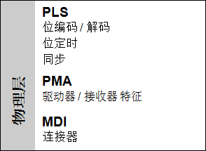
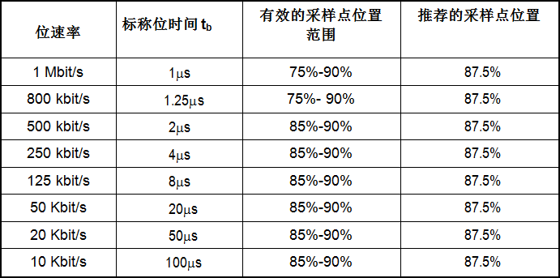
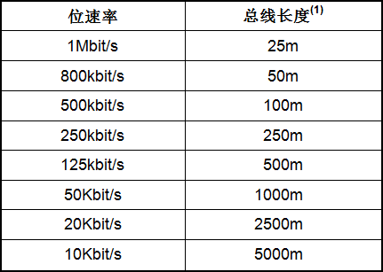

#5 **物理层**

##5.1 **OSI参考模型**

根据OSI参考模型，物理层(如图11所示)被分为三个子层：
* 介质相关接口
* 物理介质连接
* 物理信令

图11: 物理层参考模型

##5.2 **介质相关接口**
介质相关接口不属于本文范畴。

##5.3 **物理介质连接**
支持CANopen设备连接的物理介质应满足通用高速两线制差分信号传输协议/ISO11898-2/要求。

备注：可以使用其他物理介质接入技术如/ISO11898-3/。

根据/ISO11898-2/规定使用的高速收发器VCAN_H和VCAN_L最大等级应达到+16V。CANopen设备之间的电隔离可选。建议使用误连接耐压等级在30V以上的收发器。
##5.4 **物理信令**

位编码/解码和同步应符合/ISO11898-1/规范定义。

位定时应符合/ISO11898-1/规范的要求，建议参照表1的定义(总线长度范围估计见表2)。至少支持一种表中所列速度，建议都支持。

表1：推荐位定时设置

 
表2：总线长度预估

注1：总线长度的估计是基于建议位置的采样点。

总线长度的估计基于传播延迟时间为5ns/m。延迟时间要考虑到所使用控制器、CAN收发器、以及光耦合器（可选）。

