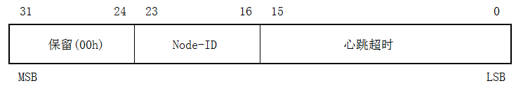
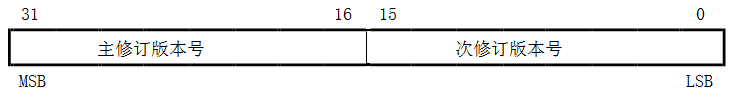
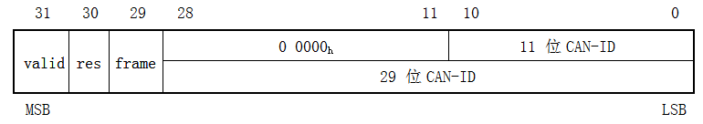
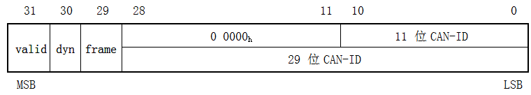
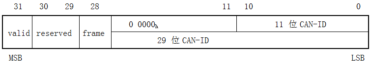
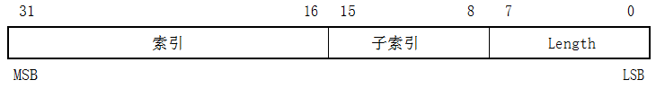
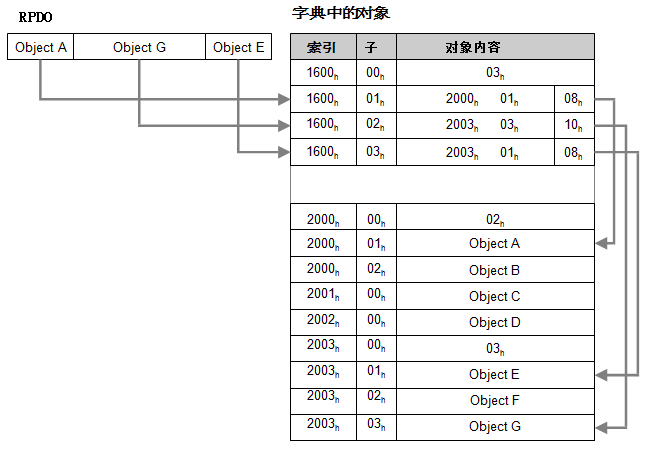
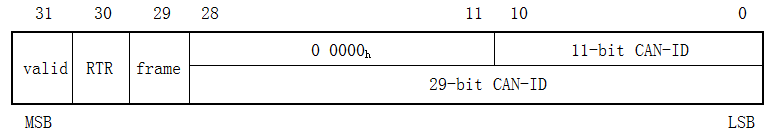

##7.5 **通信协议规范**
###7.5.1 **对象及其条目说明规范**
对象字典对象的条目结构描述遵守以下方式：所有设备协议、接口协议和应用协议都基于通信协议所使用的对象及其条目说明规则，见表52和表53。

表52：对象描述格式

**对象描述**

|索引|协议定义的索引号|
|---|---|
|名称|参数名称|
|对象代码|变量的分类|
|数据类型|数据类型分类|
|类别|可选的或强制性的区分|
对象代码是表52描述的对象定义的成员。考虑可读性，对象描述要附带对象的名称。

表53：对象值的描述格式

**条目说明**

|子索引|子项编号|
|---|---|
|描述|描述子索引名称(字段只用于数组、记录和结构)|
|数据类型|数据类型分类(字段只用于记录和结构)|
|条目类别|表明对象条目是可选、强制还是条件的|
|访问权限|只读(ro)或读/写(rw)或只写(wo)|
|PDO映射|如果该对象可映射至PDO则定义该项。说明： 可选：对象可以映射到PDO 默认值：对象是默认映射的一部分(请参见设备协议或应用协议) TPDO：对象可被映射到TPDO不应被映射到RPDO RPDO：对象可被映射到RPDO不应该映射到TPDO 无：对象不应映射到PDO|
|取值范围|可能的取值范围，或数据类型的全部取值范围|
|默认值|无：无默认值 协议指定：由协议指定默认值 造商指定：默认值由CANopen设备制造商指定 值：CANopen设备初始化后的默认值|
简单的变量带有值定义即可，无须格外的条目类别定义。复合数据类型其值定义应包括每个元素(子索引)。
###7.5.2 **通信协议对象的详细规范**
####7.5.2.1 **对象1000h：设备类型**
此对象提供有关设备类型的信息。该对象描述了逻辑设备类型及其功能。它由两个16位域组成，一个描述所用设备协议或应用协议，另一个给出逻辑设备的附加功能信息。附加的信息参数为设备协议和应用协议所指定。其说明不属于本文范围，定义于相应的设备协议和应用协议。  
**值定义**  
该值为0000h表示逻辑设备不遵守标准设备协议。在这种情况下附加的信息应为0000h(如果没有更多的逻辑设备)或FFFFh(如果还有其它逻辑设备)。  
多逻辑设备其附加信息应为FFFFh且其设备协议应为对象字典中第一逻辑设备。所有其他逻辑设备模块的协议标识于对象67FFh + x \* 800h且x = 逻辑设备内部编号(从1到8)减去1。这些对象将描述逻辑设备的设备类型，与对象1000h具有相同的值定义。  

图52：设备类型参数结构  
**对象描述**

|索引|1000h|
|---|---|
|名称|设备类型|
|对象代码|VAR|
|数据类型|UNSIGNED32|
|类别|强制|

**条目说明**  

|子索引|00h|
|---|---|
|访问权限|ro|
|PDO 映射|否|
|取值范围|请参阅*值定义*|
|默认值|协议或制造商指定|
####7.5.2.2 **对象1001h：错误寄存器**
此对象提供错误信息记录，CANopen设备将内部错误记录映射到该对象，此为应急对象的一部分。  
**值定义**

表54：错误寄存器结构

|位|M/O|意义|
|---|---|---|
|0|M|通用错误|
|1|O|电流|
|2|O|电压|
|3|O|温度|
|4|O|通信错误(溢出、错误状态)|
|5|O|设备协议指定|
|6|O|保留(始终为0b)|
|7|O|制造商指定|
如果某一特定的错误发生相应位置1b。通用错误位是强制设备必须支持的，其它可选。任何错误产生都将置位通用错误。  
**对象描述**

|索引|1001h|
|---|---|
|名称|错误寄存器|
|对象代码|VAR|
|数据类型|UNSIGNED8|
|类别|强制|
 
**条目说明**

|子索引|00h|
|---|---|
|访问权限|ro|
|PDO 映射|可选|
|取值范围|请参阅值定义|
|默认值|无|
####7.5.2.3 **对象 1002h：制造商状态寄存器**
此对象为制造商提供一个常规状态寄存器。 本规范仅定义此对象大小和位置。  
**对象描述**

|索引|1002h|
|---|---|
|名称|制造商状态寄存器|
|对象代码|VAR|
|数据类型|UNSIGNED32|
|类别|可选|
**条目说明**

|子索引|00h|
|---|---|
|访问权限|ro|
|PDO 映射|可选|
|取值范围|UNSIGNED32|
|默认值|无|
####7.5.2.4 **对象1003h：预定义错误域**
此对象表达CANopen设备上产生的错误，由应急对象编入，并提供错误历史纪录。  
**值定义**  
* 该对象子索引00h为从01h开始的实际的错误记录数量。
        备注：如果无错误存在其子索引00h值为00h，读子索引01h将得到SDO中止消息(中止代码： 0800 0024h或0800 0000h)。
* 每个新的错误应储存在子索引01h，较旧的错误应依次下移。
* 写00h到子索引00h将删除整个错误历史记录(清空数组)。禁止写入非00h值，否则将得到中止信息(错误代码:0609 0030h)。
* 错误代码的类型为UNSIGNED32(见表26)，由16位错误代码和16位制造商指定的附加错误信息组成。错误代码位于低2字节(LSB)，附加信息位于高2字节(MSB)。支持此对象应至少包含两个条目，长度子索引00h和至少一个错误项01h。

图53：预定义错误域结构
 
**对象描述**

|索引1003h|
|---|---|
|名称|预定义错误域|
|对象代码|数组|
|数据类型|UNSIGNED32|
|类别|可选|
**条目说明**

|子索引|00h|
|---|---|
|描述|错误数|
|条目类别|强制|
|访问权限|rw|
|PDO 映射|否|
|取值范围|00h到FEh|
|默认值|00h|

|子索引|01h|
|---|---|
|描述|标准错误域|
|条目类别|强制|
|访问权限|ro|
|PDO 映射|否|
|取值范围|UNSIGNED32|
|默认值|无|

|子索引|02h到FEh|
|---|---|
|描述|标准错误域|
|条目类别|可选|
|访问权限|ro|
|PDO 映射|否|
|取值范围|UNSIGNED32|
|默认值|无|

####7.5.2.5 **对象1005h：COB-ID同步消息**
此对象为已配置的同步(SYNC)对象COB-ID。此外，它定义了 CANopen 设备是否生成同步。对象结构定义于图54和表55。
值定义  

图54：同步COB-ID结构

表55：同步COB-ID描述  

|**位(S)**|**值**|**描述**|
|---|---|---|
|x|x|无意义|
|gen.|0b 1b|所在CANopen设备不生成同步消息 CANopen设备生成同步消息|
|frame|0b 1b|11位CAN-ID有效(CAN标准帧) 29位CAN-ID有效(CAN扩展帧)|
|29位CAN-ID|x|29位扩展帧CAN-ID|
|11位CAN-ID|x|11位标准帧CAN-ID|
位29(frame)和位30(gen.)可以是静态的(不可更改)。如果CANopen设备不生成同步消息，试图设置30位(gen.)为1b将得到SDO中止应答(中止代码：0609 0030h)。如果CANopen设备仅支持标准帧，则试图置位29(frame)为1b将得到SDO中止应答(中止代码：0609 0030h)。设置位30至1b并且同步计数器的溢出值大于0，在计数器值复位为1时启动第一次SYNC消息。对象有效时(位 30 = 1b)不允许更改0~29位。  
**对象描述**

|索引|1005h|
|---|---|
|名称|同步COB-ID| 
|对象代码|VAR|
|数据类型|UNSIGNED32|
|类别|条件的 强制的，如果PDO通信支持基于同步方式|
**条目说明**

|子索引|00h|
|---|---|
|访问权限|rw const如果COB-ID不可更改|
|PDO 映射|否|
|取值范围|请参阅值定义|
|默认值|0000 0080h或8000 0080h|

####7.5.2.6 **对象1006h：通信循环周期**
此对象定义SYNC时间间隔。  
**值定义**  
单位$$\mu$$s。如果置0000 0000h则禁用SYNC。通过置值为非0000 0000h并且同步计数器的溢出值大于 0，在计数器值复位为1时启动第一次SYNC消息。  
SYNC将在值更新后一个通信循环周期内启动。  
**对象描述**

|索引|1006h|
|---|---|
|名称|通信循环周期|
|对象代码|VAR|
|数据类型|UNSIGNED32|
|类别|条件的 同步生产者为强制的|
**条目说明**

|子索引|00h|
|---|---|
|访问权限|rw|
|PDO 映射|否|
|值范围|UNSIGNED32|
|默认值|0000 0000h|
####7.5.2.7 **对象1007h：同步窗长度**
此对象表达PDOs同步窗长度配置。  
如果错过同步窗，所有的TPDOs将被丢弃并且会产生EMCY消息；所有的RPDOs也被丢弃直到下次同步消息的接收。同步RPDO处理在下一个同步消息到来后恢复。  
**值定义**  
单位$$\mu$$s。如果置0000 0000h，同步窗将被禁用。  
**对象描述**

|索引|1007h|
|---|---|
|名称|同步窗长度|
|对象代码|VAR|
|数据类型|UNSIGNED32|
|类别|可选的|
 
**条目说明**

|子索引|00h|
|---|---|
|访问权限|rw|
|PDO映射|否|
|值范围|UNSIGNED32|
|默认值|0000 0000h|

####7.5.2.8 **对象1008h：制造商设备名称**
此对象为制造商的设备命名。  
**对象描述**

|索引|1008h|
|---|---|
|名称|制造商设备名称|
|对象代码|VAR|
|数据类型|VISIBLE_STRING|
|类别|可选|
**条目说明**

|子索引|00h|
|---|---|
|访问权限|const|
|PDO映射|否|
|取值范围|VISIBLE_STRING|
|默认值|制造商指定|
####7.5.2.9 **对象1009h：制造商的硬件版本**
此对象为制造商提供的硬件版本。  
**对象描述**

|索引号|1009h|
|---|---|
|名称|制造商硬件版本|
|对象代码|VAR|
|数据类型|VISIBLE_STRING|
|类别|可选|
**条目说明**

|子索引|00h|
|---|---|
|访问权限|const|
|PDO 映射|No|
|取值范围|VISIBLE_STRING|
|默认值|制造商指定|
####7.5.2.11 **对象100Ch：监护周期**
索引对象100Ch和100Dh是生存周期因子，前者配置了监护周期。其乘积给出了生存监护协议的生存周期。  
**值定义**  
单位ms。值为 0000h时禁用生存监护。  
**对象描述**

|索引|100Ch|
|---|---|
|名称|监护周期|
|对象代码|VAR|
|数据类型|UNSIGNED16|
|类别|条件的 如果支持节点保护则为强制的|
**条目说明**

|子索引|00h|
|---|---|
|访问权限|rw ro，如果不支持寿命保护|
|PDO 映射|否|
|值范围|UNSIGNED16|
|默认值|0000h|
####7.5.2.12 **对象100Dh：生存周期因子**
生存周期因子和监护周期的乘积给出了生存监护协仪的生存周期。  
**值定义**  
该值为00h应禁用生存监护。  
**对象描述**

|索引|100Dh|
|---|---|
|名称|生存周期因子|
|对象代码|VAR|
|数据类型|UNSIGNED8|
|类别|条件的 如果支持节点监护，是强制性的|
**条目说明**

|子索引|00h|
|---|---|
|访问权限|rw \ro，如果不支持生存监护|
|PDO 映射|否|
|取值范围|UNSIGNED8|
|默认值|00h|
####7.5.2.13 **对象1010h：保存参数**
此对象控制保存参数到非易失性存储器中。  
**值定义**
为了访问 CANopen 设备，应提供相关信息的保存能力。  
参数组分类： 
* 子索引00h包含子索引数。
* 子索引01h指的是所有可存储在CANopen设备上的的参数。
* 子索引02h指的是通信相关的参数(索引从1000h到1FFFh)。
* 子索引03h指的是应用相关的参数(索引从6000h到9FFFh)。
* 子索引04h到7Fh制造商可选的单独的参数。
* 子索引80h到FEh为将来的使用而保留。

为了避免存储的参数错误，存储应仅当特定暗号写到相应的子索引才被执行。暗号必须是“save”：  

图55：存储权限暗号  
在相应子索引接收到正确的暗号后，CANopen设备保存参数然后通过SDO确认(SDO下载启动响应)。如果存储失败，CANopen设备响应SDO中止(中止代码：0606 0000h)。  
如果写入暗号有误，CANopen设备拒绝保存，并且响应SDO中止传输(中止代码：0800 002xh)。  
通过读访问，CANopen设备提供存储功能相关信息，格式如下：  

图56：读结构

表56：读访问结构

|**位**|**值**|**描述**|
|---|---|---|
|auto|0b 1b|CANopen设备不自动保存参数 CANopen设备自动保存参数|
|cmd|0b 1b|CANopen设备不接受保存参数命令 CANopen设备按命令执行保存参数动作|
自动保存意味着CANopen设备参数的非易失存储无需用户请求。  
**对象描述**

|索引|1010h|
|名称|存储参数|
|对象代码|ARRAY|
|数据类型|UNSIGNED32|
|类别|可选|
**条目说明**

|子索引|00h|
|---|---|
|描述|最高子索引数|
|条目类别|强制|
|访问权限|const|
|PDO 映射|否|
|取值范围|01h~7Fh|
|默认值|协议或制造商指定|

|子索引|01h|
|---|---|
|描述|保存所有参数|
|条目类别|强制|
|访问权限|rw ro，如果支持自动保存|
|PDO 映射|否|
|取值范围|请参阅*值定义* (图55为写入；图56为只读)|
|默认值|协议或制造商指定|
 
|子索引|02h|
|---|---|
|描述|保存的通信参数|
|条目类别|可选|
|访问权限|rw ro，如果支持自动保存|
|PDO映射|否|
|取值范围|请参阅*值定义* (图55为写入；图56为只读访问权限)|
|默认值|协议或制造商指定|

|子索引|03h|
|---|---|
|描述|保存应用参数|
|条目类别|可选|
|访问权限|rw ro，如果支持自动保存|
|PDO映射|否|
|取值范围|请参阅*值定义* (图55为写入；图56为只读访问权限)|
|默认值|协议或制造商指定|

|子索引|04h~7Fh|
|---|---|
|描述|保存制造商定义的参数|
|条目类别|可选|
|访问权限|rw ro，如果支持自动保存|
|PDO映射|否|
|取值范围|请参阅*值定义* (图55为写入；图56为只读访问权限)|
|默认值|协议或制造商指定|
####7.5.2.14 **对象1011h：恢复缺省参数**
通过该对象根据协议、设备协议和应用协议恢复参数默认值。  
**值定义**
通过读取访问，CANopen设备提供有关恢复相关值的功能信息。其参数组的分类：
* 子索引00h包含支持的最大子索引数。
* 子索引01h指恢复所有参数。
* 子索引02h指恢复通信相关参数(索引从1000h到1FFFh)。
* 子索引03h恢复应用相关参数(索引从6000h到9FFFh)。
* 子索引04h到7Fh为制造商指定的恢复特定参数。
* 子索引80h到FEh为将来的使用而保留。

为了避免误动作，恢复应仅当写入暗号到相应的子索引有效。暗号为“load”： 

图57：恢复默认值的写入暗号

CANopen设备接收到正确的暗号后就会恢复相应参数值为默认值，然后通过SDO应答确认(SDO下载启动应答)。如果恢复失败会得到SDO中止应答(中止代码：0606 0000h)。如果暗号写入错误，CANopen设备应拒绝恢复操作并应答SDO中止(中止代码：0800 002xh)。
CANopen设备复位(对于子索引01h到7Fh执行NMT复位节点服务，对于子索引02h需要执行NMT复位通信服务)或掉电重启后默认值生效。  

图58：恢复默认值过程

通过读访问，CANopen设备提供恢复参数功能相关信息，格式如下：  

图59：恢复默认的读访问结构

表57：恢复默认的读访问结构

|**位**|**值**|**描述**|
|---|---|
|cmd|0b 1b|CANopen设备不支持恢复默认参数  CANopen设备支持恢复参数|
**对象描述**

|索引|1011h|
|---|---|
|名称|恢复缺省参数|
|对象代码|ARRAY|
|数据类型|UNSIGNED32|
|类别|可选|

|子索引|00h|
|---|---|
|描述|最高子索引数|
|条目类别|强制|
|访问权限|const|
|PDO映射|否|
|取值范围|01h~7Fh|
|默认值|协议或制造商指定|

|子索引|01h|
|---|---|
|描述|恢复所有默认的参数|
|条目类别|强制|
|访问权限|rw|
|PDO 映射|否|
|取值范围|请参阅值定义 (图57为写访问；图59读访问)|
|默认值|协议或制造商指定|

|子索引|02h|
|---|---|
|描述|恢复默认的通信参数|
|条目类别|强制|
|访问权限|rw|
|PDO 映射|否|
|取值范围|请参阅值定义 (图57为写访问；图59读访问)|
|默认值|协议或制造商指定|

|子索引|03h|
|---|---|
|描述|恢复应用的默认参数|
|条目类别|强制|
|访问权限|rw|
|PDO 映射|否|
|取值范围|请参阅值定义 (图57为写访问；图59读访问)|
|默认值|协议或制造商指定|

|子索引|04h~7Fh|
|---|---|
|描述|还原制造商定义的默认参数|
|条目类别|可选|
|访问权限|rw|
|PDO 映射|否|
|取值范围|请参阅值定义 (图57为写访问；图59读访问)|
|默认值|协议或制造商指定| 
####7.5.2.15 **对象1012h：时间戳对象COB-ID**
此对象为时间戳对象(TIME)的COB-ID配置。此外，它还定义了CANopen设备是否消费TIME或是否生成TIME。对象结构见图60和表58。  
**值定义**

图60：TIME COB-ID结构

表58：TIME COB-ID说明
|**位(们)**|**值**|**描述**|
|consume|0b 1b|CANopen设备不消费TIME消息 CANopen设备消费TIME消息|
|produce|0b 1b|CANopen设备不会产生TIME消息  CANopen设备产生TIME消息|
|frame|0b 1b|11位CAN-ID有效(CAN标准帧) 29位CAN-ID有效(CAN扩展帧)|
|29位CAN-ID|x|29位CAN-ID的扩展帧|
|11位CAN-ID|x|11位CAN-ID 的标准帧|
位29(frame)、30(produce)可以是静态的(不能更改)。如果CANopen设备不支持生成TIME，试图置位30(produce)为1b将得到SDO中止传输应答(中止代码：0609 0030h)。如果CANopen设备仅支持标准帧，试图置位29(frame)1b得到SDO中止传输应答(中止代码：0609 0030h)。当此对象存在(位30=1b或位31=1b)时位0至29不可更改。  
**对象描述**

|索引|1012h|
|---|---|
|名称|时间戳COB-ID|
|对象代码|VAR|
|数据类型|UNSIGNED32|
|类别|可选的|

|子索引|00h|
|---|---|
|访问权限|rw|
|PDO 映射|否|
|取值范围|UNSIGNED32|
|默认值|CAN-ID：100h frame：0b 有效：协议或制造商指定|

####7.5.2.16 **对象1013h：高分辨率时间戳**
此对象表达已配置的高分辨率时间戳。它可能会被映射到PDO，以交换高分辨率时间戳的消息。鼓励更深入的应用。  
**值定义**  
单位$$\mu$$s。  
**对象描述**

|索引|1013h|
|---|---|
|名称|高分辨率时间戳|
|对象代码|VAR|
|数据类型|UNSIGNED32|
|类别|可选|
**条目说明**

|子索引|00h|
|---|---|
|访问权限|rw ro，如果仅支持生成高分辨率时间戳 rw或wo，如果仅支持高分辨率时间戳消费|
|PDO映射|可选|
|取值范围|UNSIGNED32|
|默认值|0|
####7.5.2.17 **对象1014h：EMCY COB-ID**
此对象表达已配置的EMCY 写服务COB-ID。  
**值定义**

图61：EMCY标识结构
 

表59：EMCY COB-ID说明

|**位(们)**|**值**|**描述**|
|---|---|---|
|valid|0b 1b|EMCY存在/有效 EMCY不存在/无效|
|30|0b|保留(始终为0b)|
|frame|0b 1b|11CAN-ID有效(CAN标准帧) 29位CAN-ID有效(CAN扩展帧)|
|29位CAN-ID|x|29位CAN-ID的扩展帧|
|11位CAN-ID|x|11位CAN-ID的标准帧|

仅支持标准帧的CANopen设备企图置位29(frame)为1b将得到SDO中止传输响应(中止代码：0609 0030h)。当应急对象有效(位31= 0b)时，位0至29禁止更改。  
**对象描述**

|索引|1014h|
|---|---|
|名称|应急消息COB-ID|
|对象代码|VAR|
|数据类型|UNSIGNED32|
|类别|条件的 强制性的，如果支持应急对象|
**条目说明**

|子索引|00h|
|---|---|
|访问权限|rw const如果COB-ID不可更改|
|PDO映射|否|
|取值范围|UNSIGNED32|
|默认值|CAN-ID：80h+Node-ID frame：0b valid：协议或制造商指定|
####7.5.2.18 **对象1015h：EMCY抑制时间**
此对象表达EMCY 消息抑制时间的配置。  
**值定义**  
单位100$$\mu$$s。值为0将禁用抑制时间。  
**对象描述**

|索引|1015h|
|---|---|
|名称|EMCY抑制时间|
|对象代码|VAR|
|数据类型|UNSIGNED16|
|类别|可选的|
 
|子索引|00h|
|---|---|
|访问权限|rw|
|PDO映射|否|
|取值范围|UNSIGNED16|
|默认值|0|
####7.5.2.19 **对象1016h：消费者心跳超时**
该对象为期望的心跳周期，从接收第一次心跳开始监测心跳生产者。  
注意：消费者心跳超时应大于相应的生产者的心跳周期。  
注：在检测到生产者的第一次心跳前其状态未知。  
**值定义**  

图62：消费者心跳超时结构  
如果心跳时间为0或者Node-ID为0或大于127，则对应的对象条目无效。心跳超时单位ms。  
为相同的node-ID尝试配置多个非0心跳时间，CANopen设备将响应SDO中止应答(中止代码：0604 0043h)。  
**对象描述**

|索引|1016h|
|---|---|
|名称|消费者心跳超时|
|对象代码|ARRAY|
|数据类型|UNSIGNED32|
|类别|可选的|
**条目说明**

|子索引|00h|
|---|---|
|描述|最大子索引数|
|条目类别|强制|
|访问权限|const|
|PDO映射|否|
|取值范围|01h~7Fh|
|默认值|协议或制造商指定|
 
|子索引|01h|
|---|---|
|描述|消费者心跳超时|
|条目类别|强制|
|访问权限|rw|
|PDO映射|否|
|取值范围|UNSIGNED32(图62)|
|默认值|0000 0000h|

|子索引|02h~7Fh|
|---|---|
|描述|消费者心跳超时|
|条目类别|可选|
|访问权限|rw|
|PDO映射|否|
|取值范围|UNSIGNED32(图62)|
|默认值|0000 0000h|
####7.5.2.20 **对象1017h：生产者心跳超时**
该对象为心跳周期的配置。  
**值定义**  
单位ms。0值将禁用生产者心跳。  
**对象描述**

|索引|1017h|
|---|---|
|名称|生产者心跳超时
|对象代码|VAR|
|数据类型|UNSIGNED16|
|类别|有条件的 强制性的，如果不支持监护|
**条目说明**

|子索引|00h|
|---|---|
|访问权限|rw const，如果默认值为协议指定且不可更改|
|PDO映射|否|
|取值范围|UNSIGNED16|
|默认值|0或协议指定|
####7.5.2.21 **对象1018h：对象身份**
此对象提供CANopen设备的身份识别信息。  
**值定义**  
* 子索引01h包含有特定的值1为每个CANopen 设备供应商所独有。值0000 0000h表明无效的供应商标识。 
* 子索引02h包含有特定的值，来识别特定类型的CANopen设备。值0000 0000h应被保留。
* 子索引03h应包含CANopen设备的主修订版本号和次修订版本号(参见图63)。主修订版本号应指明特定的CANopen行为。这意味着如果CANopen功能发生变化,主修订版本号应增加。次修订版本号应识别具有相同CANopen行为的不同版本的CANopen设备。值0000 0000h应被保留。

图63：修订版本号结构

子索引04h包含序列号，为某一组产品和特定版本CANopen设备的唯一标识。值0000 0000h应被保留。  
**对象描述**

|索引|1018h|
|---|---|
|名称|对象身份|
|对象代码|RECORD|
|数据类型|Identity|
|类别|强制性|
**条目说明**

|子索引|00h|
|---|---|
|描述|最大子索引数|
|条目类别|强制性|
|访问权限|const|
|PDO映射|否|
|取值范围|01h到04h|
|默认值|协议或制造商指定|

1值由CAN in Automation ( CiA ) 唯一分配。

|子索引|01h|
|---|---|
|描述|Vendor-ID|
|条目类别|强制性|
|访问权限|ro|
|PDO映射|否|
|取值范围|UNSIGNED32|
|默认值|由CiA唯一分配给制造商|

|子索引|02h|
|---|---|
|描述|产品码|
|条目类别|可选的|
|访问权限|ro|
|PDO映射|否|
|取值范围|UNSIGNED32|
|默认值|协议或制造商指定商|

|子索引|03h|
|---|---|
|描述|修订版本号|
|条目类别|可选的|
|访问权限|ro|
|PDO映射|否|
|取值范围|UNSIGNED32|
|默认值|协议或制造商指定商|

|子索引|04h|
|---|---|
|描述|序列号|
|条目类别|可选的|
|访问权限|ro|
|PDO映射|否|
|取值范围|UNSIGNED32|
|默认值|协议或制造商指定商|
####7.5.2.22 **对象1019h：同步计数器溢出值**
此对象为同步计数器支持的最大值配置。如果CANopen设备支持同步计数器，生产者和消费者应支持此对象。如果该值大于1，同步信息应带有数据长度为1字节的数据。SYNC消费者应忽略该值本身。一旦SYNC消费者发现接收的SYNC消息数据长度与配置的不同将发送EMCY消息(错误代码：8240h-意外的同步数据长度)。  
**值定义**  

|**值**|**描述**|
|---|---|
|0|SYNC消息数据长度为0|
|1|保留|
|2~240|SYNC消息数据长度为1。第一个数据字节包含计数器|
|241~255|保留的|
该值应为所有TPDO的传输类型(1<n<= 240 )的最小公倍数。从而可以确保SYNC事件总是发生于SYNC循环的同一计数值。
一旦SYNC循环周期非0，对本索引值的更改将触发SDO中止应答(中止代码：0800 0022h或0800 0000h)。
**对象描述**  

|索引|1019h|
|---|---|
|名称|同步计数器溢出值|
|对象代码|VAR|
|数据类型|UNSIGNED8|
|类别|可选的|
**条目说明**

|子索引|00h|
|---|---|
|访问权限|rw const，如果协议指定默认值不可更改|
|PDO映射|否|
|取值范围|UNSIGNED8|
|默认值|0或协议指定|
####7.5.2.23 **对象1020h：验证配置**
此对象保存下载配置的日期和时间。如果CANopen设备支持保存参数到非易失性存储器，网络配置工具或CANopen管理器使用该对象在设备复位后验证配置，检查是否需要重新配置。配置工具将该对象存储的相同日期和时间值同时存入DCF。然后配置工具通过向CANopen设备索引1010h的子索引01h写入 “save”来保存配置。CANopen设备复位后应能自动或由请求来恢复最近一次的配置和识别标记。如果有任何其他命令更改了启动配置值，CANopen设备均应重置验证配置对象为0。  
配置管理器将比较识别标记和DCF中的配置值，决定是否需要重置。  
注意：使用此对象需允许超前于启动过程的识别标识。如果使用该对象，系统集成商能够识别出用户更改了配置，并且随后激活了1010h的保存命令，但并未更改1020h。因而系统集成商通过使用该功能可以100% 确认上述情况。  
**值定义**  
* 子索引01h(配置日期)应包含自1984年1月1日的天数。 
* 子索引02h(配置时间)为自午夜开始的ms数。
 
**对象描述**

|索引|1020h|
|---|---|
|名称|验证配置|
|对象代码|ARRAY|
|数据类型|UNSIGNED32|
|类别|可选的|
**条目说明**

|子索引|00h|
|---|---|
|描述|子索引数|
|条目类别|强制性|
|访问权限|const|
|PDO映射|否|
|取值范围|02h|
|默认值|02h|

|子索引|01h|
|---|---|
|描述|配置日期|
|条目类别|强制性|
|访问权限|rw|
|PDO映射|否|
|取值范围|UNSIGNED32|
|默认值|制造商指定|

|子索引|02h|
|---|---|
|描述|配置时间|
|条目类别|强制性|
|访问权限|rw|
|PDO映射|否|
|取值范围|UNSIGNED32|
|默认值|制造商指定|
####7.5.2.24 **对象1021h：存储EDS**
此对象描述装载的EDS。EDS文件存储于CANopen设备上具有以下优势：  
* 制造商不存在通过磁盘分发EDS的问题。
* 如果不同软件版本的不同EDS版本是存放在一起，管理它们不容易出错。
* 完整的网络配置保存于网络，使得分析或重新配置网络更方便并且对用户更透明。

**值定义**
文件名不需要存储，因为每个EDS文件包含其自身文件名。  
 
**对象描述**

|索引|1021h|
|---|---|
|名称|EDS的存储|
|对象代码|VAR|
|数据类型|域|
|类别|可选的|
**条目说明**

|子索引|00h|
|---|---|
|访问权限|ro|
|PDO映射|否|
|取值范围|制造商指定|
|默认值|无|
####7.5.2.25 **对象1022h：存储格式**
该对象为存储格式说明，允许使用的压缩格式。对象仅描述外部行为。  
**值定义**  

表60：EDS存储格式

|**值**|**描述**|
|---|---|
|00h|/ISO 10646/不压缩|
|01h|保留的|
|: : : : :|: : : : :|
|7Fh|保留的|
|80h|制造商指定|
|: : : : :|: : : : :|
|FFh|制造商指定|
**对象描述**

|索引|1022h|
|---|---|
|名称|存储格式|
|对象代码|VAR|
|数据类型|UNSIGNED16|
|类别|条件的 如果支持存储EDS则强制|
**条目说明**

|子索引|00h|
|---|---|
|访问权限|ro|
|PDO映射|否|
|取值范围|UNSIGNED8|
|默认值|无|
####7.5.2.26 **对象1023h：OS命令**
该对象将用作可编程设备的命令驱动接口。命令内容为/ISO8859/字符或由制造商完全指定的二进制。   由主系统将OS命令传给对象。  
**值定义**  
如果CANopen设备实现此功能，必须支持所有子索引，附加的对象条目由制造商指定。当状态范围从0到3表示有新的命令输入：命令和所有参数应作为一整块传入子索引01h。命令传输完成应立即执行。主机轮询子索引 02h,直到其值从0到3。如果状态值是1或3，主机可以接着发送回复。如果回复请求多次，或改变状态从1到0或3到2,或不能缓存回复，CANopen设备应返回相同的回复。（译注：~~笔者未使用过该对象，对其理解不明确~~）  
**对象描述**

|索引|1023h|
|---|---|
|名称|OS命令|
|对象代码|RECORD|
|数据类型|OS command record|
|类别|可选的|

**条目说明**

|子索引|00h|
|---|---|
|描述|子索引数|
|条目类别|强制性|
|访问权限|const|
|PDO映射|否|
|取值范围|03h|
|默认值|03h|

|子索引01h|
|---|---|
|描述|命令|
|条目类别|强制性|
|访问权限|rw wo，如果只支持写|
|PDO 映射|否|
|取值范围|无|
|默认值|制造商指定|
 

|子索引|02h|
|---|---|
|描述|状态|
|条目类别|强制性|
|访问权限|ro|
|PDO映射|否|
|取值范围|UNSIGNED8|
|默认值|无|

|子索引|03h|
|---|---|
|描述|回复|
|条目类别|强制性|
|访问权限|ro|
|PDO映射|否|
|取值范围|无|
|默认值|无|
####7.5.2.27 **对象1024h：OS命令模式**
此对象控制应用指定队列的命令执行。其目的是希望通过该对象指导应用指定队列中最近的命令。  
**值定义**  

表61：OS命令模式值

|**值**|**描述**|
|---|---|
|00h|立即执行下一条命令|
|01h|缓冲下一条命令|
|02h|执行缓冲区中的命令|
|03h|中止当的命令和缓冲区中所有命令|
|04h|制造商指定|
|: : : : :|: : : : :|
|FFh|制造商指定|
**对象描述**

|索引|1024h|
|---|---|
|名称|OS命令模式|
|对象代码|VAR|
|数据类型|UNSIGNED8|
|类别|可选的|
 
**条目说明**

|子索引|00h|
|---|---|
|访问权限|wo|
|PDO映射|否|
|取值范围|UNSIGNED8|
|默认值|制造商指定|
####7.5.2.28 **对象1025h：OS调试接口**
此对象对应OS调试接口，是可编程CANopen设备调试器的二进制命令接口。命令内容由制造商指定。该对象允许用户连接到远程的调试器。  
**值定义**  
参阅OS命令  
**对象描述**

|索引|1025h|
|---|---|
|名称|OS调试接口|
|对象代码|RECORD|
|数据类型|OS debug record|
|类别|可选|

**条目说明**

|子索引|00h|
|---|---|
|描述|子索引数|
|条目类别|强制性|
|访问权限|const|
|PDO映射|否|
|取值范围|03h|
|默认值|03h|

|子索引|01h|
|---|---|
|描述|命令|
|条目类别|强制性|
|访问权限|rw wo，如果仅支持只写|
|PDO映射|否|
|取值范围|无|
|默认值|制造商指定|
 

|子索引|02h|
|---|---|
|描述|状态|
|条目类别|强制性|
|访问权限|ro|
|PDO映射|否|
|取值范围|UNSIGNED8|
|默认值|无|

|子索引|03h|
|---|---|
|描述|回复|
|条目类别|强制性|
|访问权限|ro|
|PDO映射|否|
|取值范围|无|
|默认值|无|
####7.5.2.29 **对象1026h：OS提示符命令接口**
该对象是可编程CANopen设备的字符驱动命令接口。命令内容由制造商指定。该对象允许用户实现远程键盘控制。  
**值定义**  
子索引01hStdIn是通过SDO或PDO用来向CANopen设备传输单个字符的接口。每个新字符均被加入内部输入队列。CANopen设备应答通过子索引02hStdout输出。该对象通常被映射到一个事件驱动的PDO或轮询SDO中。子索引03hStdErr用于错误输出。该对象通常被映射到一个事件驱动的PDO或轮询SDO中。  
**对象描述**

|索引|1026h|
|---|---|
|名称|OS提示符命令接口|
|对象代码|ARRAY|
|数据类型|UNSIGNED8|
|类别|可选|
**条目说明**

|子索引|00h|
|---|---|
|描述|子索引数|
|条目类别|强制性|
|访问权限|const|
|PDO映射|否|
|取值范围|02h~03h|
|默认值|无|

|子索引|01h|
|---|---|
|描述|StdIn|
|条目类别|强制|
|访问权限|wo|
|PDO映射|可选|
|取值范围|UNSIGNED8|
|默认值|制造商指定|

|子索引|02h|
|---|---|
|描述|StdOut|
|条目类别|强制|
|访问权限|ro|
|PDO映射|可选|
|取值范围|UNSIGNED8|
|默认值|无|

|子索引|03h|
|---|---|
|描述|StdErr|
|条目类别|可选|
|访问权限|ro|
|PDO映射|可选|
|取值范围|UNSIGNED8|
|默认值|无|
####7.5.2.30 **对象1027h：模块列表**
组合连接模块化CANopen设备的通用方法是使用总线耦合器。该对象提供当前已连接模块的信息列表。  
**值定义**  
连续的子索引(1≤N≤254)描述了相应模块的顺序连接。每个对象的条目包含了模块的识别号。此识别号能够唯一区分连到总线耦合器上的所有设备类型。  
该对象的条目子索引00h为实际连接到总线耦合器上的模块数量。  
注：如果没有模块存在，子索引00h的值为00h，读取子索引01h响应SDO中止应答(中止代码：0800 0024h 或0800 0000h)。  
**对象描述**

|索引|1027h|
|---|---|
|名称|模块列表|
|对象代码|ARRAY|
|数据类型|UNSIGNED16|
|类别|有条件的 强制，如果支持模块化的设备|
 
**条目说明**

|子索引|00h|
|---|---|
|描述|连接模块数|
|条目类别|强制|
|访问权限|const|
|PDO映射|否|
|取值范围|01h~FEh|
|默认值|无|

|子索引|01h|
|---|---|
|描述|模块1|
|条目类别|强制|
|访问权限|ro|
|PDO映射|否|
|取值范围|UNSIGNED16|
|默认值|无|

|子索引|02h~FEh|
|---|---|
|描述|模块2至模块254|
|条目类别|可选|
|访问权限|ro|
|PDO映射|否|
|取值范围|UNSIGNED16|
|默认值|无|
####7.5.2.31 **对象1028h：应急消费对象**
此对象应表明该CANopen设备消费的EMCY对象的COB-ID配置。  
**值定义**  

图64：EMCY COB-ID结构
 

表62: EMCY COB-ID说明

|**位(们)**|**值**|**描述**|
|---|---|---|
|valid|0b 1bEMCY消费者存在/有效 EMCY消费者不存在/无效|
|res|0b|保留(始终为0b)|
|frame|0b 1b|11位CAN-ID有效(标准帧) 29位CAN-ID有效(扩展帧)
|29位CAN-ID|X|29位CAN-ID 的扩展帧|
|11位CAN-ID|X|11位CAN-ID的标准帧|
仅支持标准帧的CANopen 设备企图置位29(frame)为1b将得到SDO中止传输响应(中止代码：0609 0030h)。当应急对象有效(位31=0b)时，位0至29禁止更改。  
子索引号关联node-ID。  
**对象描述**  

|索引|1028h|
|---|---|
|名称|应急消费者|
|对象代码|ARRAY|
|数据类型|UNSIGNED32|
|类别可选|

**条目说明**

|子索引|00h|
|---|---|
|描述|子索引数|
|条目类别|强制|
|访问权限|const|
|PDO映射|否|
|取值范围|01h~7Fh|
|默认值|协议或制造商指定|

|子索引|01h|
|---|---|
|描述|应急消费者1|
|条目类别|强制|
|访问权限|rw const，如果应急消费者不可更改|
|PDO映射|否|
|取值范围|请参阅值定义|
|默认值|协议或制造商指定|
 

|子索引|02h~7Fh|
|---|---|
|描述|应急消费者2~127|
|条目类别|可选|
|访问权限|rw; const，如果应急消费者不可更改|
|PDO映射|否|
|取值范围|请参阅值定义|
|默认值|协议或制造商指定|
####7.5.2.32	对象1029h：错误行为对象
如果在运行态检测到严重的CANopen设备故障，CANopen设备默认应自动进入NMT配置态。如果支持该对象，CANopen设备将配置为可选择进入NMT停止态或继续留在当前NMT状态。CANopen设备故障包括以下通信错误：  
* CAN接口总线关闭
* 生存监护事件状态为“occurred”且其原因为“time out”。
* 心跳事件状态为“occurred”且其原因为“time out”。

某些CANopen设备错误也可能导致CANopen设备的内部故障。  
**值定义**

表63：错误类别值

|**值**|**描述**|
|---|---|
|00h|更改为NMT配置态(仅当当前设备状态为NMT运行态)|
|01h|NMT状态不更改|
|02h|更改为NMT停止态|
|03h|保留|
|: : : : :|: : : : :|
|7Fh|保留|
|80h|制造商指定|
|: : : : :|: : : : :|
|FFh|制造商指定|
**对象描述**

|索引|1029h|
|---|---|
|名称|错误行为|
|对象代码|ARRAY|
|数据类型|UNSIGNED8|
|类别|可选|
 
**条目说明**

|子索引|00h|
|---|---|
|描述|子索引数|
|条目类别|强制|
|访问权限|const|
|PDO映射|否|
|取值范围|01h~FEh|
|默认值|协议或制造商指定|

|子索引|01h|
|---|---|
|描述|通信错误|
|条目类别|强制|
|访问权限|rw const，如果通信错误的错误行为不可更改|
|PDO映射|否|
|取值范围|UNSIGNED8|
|默认值|00h|

|子索引|02h~FEh|
|---|---|
|描述协议或制造商指定的错误|
|条目类别|可选|
|访问权限|rw; const，如果错误的行为不可更改|
|PDO映射|否|
|取值范围|请参阅*值定义*|
|默认值|协议或制造商指定|
####7.5.2.33 **对象1200h~127Fh：SDO服务器参数**
为了描述CANopen设备使用的SDO，前文介绍了SDO参数的数据类型。该数据类型在对象字典索引22h处。该结构定义见7.4.8。  
**值定义**  
子索引00h是SDO支持的参数数量。子索引01h和02h指定SDO的COB-ID。子索引03h是该CANopen设备的客户端node-ID。  

图65：SDO服务器COB-ID结构
 

表64：SDO服务器COB-ID说明

|**位(们)**|**值**|**描述**|
|---|---|
|valid|0b 1bSDO存在/有效 SDO不存在/无效|
|dyn|0b 1b|值静态分配 值动态分配|
|frame|0b 1b|11位CAN-ID有效(标准帧) 29位CAN-ID有效(扩展帧)|
|29位CAN-ID|x|29位CAN-ID的扩展帧|
|11位CAN-ID|x|11位CAN-ID的标准帧|
SDO仅在子索引01h和02h的最高位置0b时有效。仅支持标准帧的CANopen设备企图置位29(frame)为1b将得到SDO中止传输响应(中止代码：0609 0030h)。当该对象存在并有效(位 31 = 0b)时，位0至29禁止更改。  
如果子索引01h或02h位dyn(位30)设为1b，该对象所有参数不能保存在非易失性存储器中，该位用于标记支持动态SDO连接的CANopen设备。动态SDO连接是使用前临时配置。静态SDO连接配置是长效的，因而要保存在非易失性存储器中。CANopen管理器可以通过dyn位检测SDO连接的动态性。  
**对象描述**  

|索引|1200h~127Fh|
|---|---|
|名称|SDO服务器参数|
|对象代码|RECORD|
|数据类型|SDO parameter record|
|类别|**条件** 索引1200h：可选 索引1201h~127Fh：只要支持了其参数就是强制性的|
**条目说明**

|子索引|00h|
|---|---|
|描述|子索引数|
|条目类别|强制性|
|访问权限|const|
|PDO映射|否|
|取值范围|索引1200h：02h 索引1201h~127Fh：02h~03h|
|默认值|协议或制造商指定|

|子索引|01h|
|---|---|
|描述|COB-ID客户端->服务器(rx)|
|条目类别|强制性|
|访问权限|**索引1200h:** const **索引1201h~127Fh:** rw const，如果由应用协议定义|
|PDO映射|可选|
|取值范围|请参阅*值定义*|
|默认值|**索引1200h：** CAN-ID：600h+Node-ID frame：0b dyn：0b valid：0b **索引1201h~127Fh：** CAN-ID：制造商制定(参见7.3.5) frame：制造商指定 dyn:0b valid：1b或由应用协议定义|

|子索引|02h|
|---|---|
|描述|COB-ID服务器->客户端(tx)|
|条目类别|强制性|
|访问权限|**索引1200h：** ro **索引1201h~127Fh：** rw const，如果由应用协议定义|
|PDO映射|可选|
|取值范围|请参阅*值定义*|
|默认值|**索引1200h：** CAN-ID5800h+Node-ID frame：0b dyn：0b valid：0b **索引1201h~127Fh：** CAN-ID：制造商制定(参见7.3.5) frame：制造商指定 dyn:0b valid：1b或由应用协议定义|

|子索引|03h|
|---|---|
|描述|SDO客户端Node-ID|
|条目类别|可选|
|访问权限|rw|
|PDO映射|否|
|取值范围|01h~7Fh|
|默认值|制造商指定|
####7.5.2.34 **对象1280h~12FFh：SDO客户端参数**
对象包含CANopen设备作为SDO客户端所需参数。如果设备支持该对象，所有子索引必须可用。这部分索引起始于1280h。  
**值定义**  
子索引00h是SDO支持的参数数量。子索引01h和02h指定SDO的COB-ID。子索引03h是该CANopen设备的服务器node-ID。  

图66：SDO客户端COB-ID结构

表65：SDO客户端COB-ID说明

|**位(们)**|**值**|**描述**|
|---|---|
|valid|0b 1b|SDO存在/有效 SDO不存在/无效|
|dyn|0b 1b|值静态分配 值动态分配|
|frame|0b 1b|11位CAN-ID有效(标准帧) 29位CAN-ID有效(扩展帧)|
|29位CAN-ID|x|29位CAN-ID的扩展帧|
|11位CAN-ID|x|11位CAN-ID的标准帧|
SDO仅在子索引01h和02h的最高位置0b时有效。仅支持标准帧的CANopen设备企图置位29(frame)为1b将得到SDO中止传输响应(中止代码：0609 0030h)。如果设备支持使能(位31=0b)和禁止(bit 31 = 1b)SDO客户端的操作，对位0至30更改将返回SDO中止传输相应(中止代码：0609 0030h 或 0800 000h)。  
如果子索引01h或02h位dyn(位30)设为1b，该对象所有参数不能保存在非易失性存储器中，该位用于标记支持动态SDO连接的CANopen设备。动态SDO连接是使用前临时配置。静态SDO连接配置是长效的，因而要保存在非易失性存储器中。CANopen管理器可以通过dyn位检测SDO连接的动态性。  
**对象描述**

|索引|1280h~12FFh|
|---|---|
|名称|SDO客户端参数|
|对象代码|RECORD|
|数据类型|SDO parameter record|
|类别|**条件** 每个支持的客户端其对应对象都是强制性的|

**条目说明**

|子索引|00h|
|---|---|
|描述|子索引数|
|条目类别|强制性|
|访问权限|const|
|PDO映射|否|
|取值范围|03h|
|默认值|03h|

|子索引|01h|
|---|---|
|描述|COB-ID 客户端->服务器(tx)|
|条目类别|强制|
|访问权限|rw; const，如果由应用协议定义|
|PDO映射|可选|
|取值范围|请参阅*值定义*|
|默认值|CAN-ID：制造商指定(参见7.3.5) frame：制造商指定 dyn：0b valid：1b或由应用协议定义|

|子索引|02h|
|---|---|
|描述|COB-ID 服务器->客户端(rx)|
|条目类别|强制|
|访问权限|rw const，如果由应用程序定义|
|PDO映射|可选|
|取值范围|请参阅*值定义*|
|默认值|CAN-ID：制造商指定(参见7.3.5) frame：制造商指定 dyn：0b valid：1b或由应用协议定义|

|子索引|03h|
|---|---|
|描述|SDO服务器Node-ID|
|条目类别|强制|
|访问权限|rw const，如果值不可更改的|
|PDO映射|否|
|取值范围|01h~7Fh|
|默认值|制造商指定|
####7.5.2.35 **对象1400h~15FFh：RPDO通信参数**
此对象包含CANopen设备接收PDOs的通信参数。  
**值定义**  
子索引00h包含有效的对象条目记录。其值至少是02h。如果支持抑制时间其值为03h，如果支持事件定时器其值为05h。  
子索引01h包含RPDO的COB-ID(见图67和表66)。

图67：RPDO的COB-ID结构

表66：RPDO COB-ID说明

|**位(们)**|**值**|**描述**|
|---|---|
|valid|0b 1b|PDO存在/有效 PDO不存在/无效|
|reserved|x|任意|
|frame|0b 1b|11位CAN-ID有效(标准帧) 29位CAN-ID有效(扩展帧)|
|29位CAN-ID|x|29位CAN-ID的扩展帧|
|11位CAN-ID|x|11位CAN-ID的标准帧|
valid(位31)允许设定在NMT运行态哪些RPDO可用。PDOs可以配置但不使用，清除该位即可。对于支持4个RPDOs的CANopen设备，该功能是必要的，因为每个CANopen设备前四个RPDO是带有默认CAN-ID的通用预定义连接集。仅支持标准帧的CANopen设备企图置位29(frame)为1b将得到SDO中止传输响应(中止代码：0609 0030h)。当该对象存在并有效(位 31 = 0b)时，位0至29禁止更改。如果设备支持使能(位31=0b)和禁止(bit31 = 1b)RPDO操作，对位0至30更改将返回SDO中止传输相应(中止代码：0609 0030h或0800 000h)。  
如果CANopen设备使用设备协议，一定要支持通用预定义连接集(见表67)。

表67：RPDO的通用预定义连接集

|**索引**|**默认值**|
|---|---|
|1400h|CAN-ID：200h + Node-ID frame：0b reserved：制造商指定 valid：协议或制造商指定|
|1401h|CAN-ID：300h + Node-ID frame：0b reserved：制造商指定 valid：协议或制造商指定|
|**索引**|**默认值**|
|1402h|CAN-ID：400h + Node-ID frame：0b reserved：制造商指定 valid：协议或制造商指定|
|1403h|CAN-ID：500h + Node-ID frame：0b reserved：制造商指定 valid：协议或制造商指定|
|1404h 15FFh|CAN-ID：协议或制造商指定(见7.3.5) frame：协议或制造商指定 reserved：制造商指定 valid：1b或由应用协议定义|
如果CANopen设备使用应用协议，则应遵守应用协议的预定义连接集。  
子索引02h定义了RPDO的接收性质(见表68)。试图更改其值为任何不支持的传输类型将应答SDO中止(中止代码:0609 0030h)。  

表68：RPDO传输类型说明

|**值**|**描述**|
|---|---|
|00h|同步|
|: : : : :|: : : : :|
|F0h|同步|
|F1h|保留|
|: : : : :|: : : : :|
|FDh|保留|
|FEh|事件驱动(制造商指定)|
|FFh|事件驱动(设备协议和应用协议指定)|
* 同步意味着该CANopen设备在收到紧接着的一帧SYNC(见图68)后生效接收的数据。
* 事件驱动意味着任何时候都可以接收PDO。且数据立即生效。

图68：总线同步和生效  

子索引03h包含抑制时间。该值单位为100$$\mu$$s。值为0表示禁用。该值在PDO生效(子索引01h位31设为0b)时不可更改。RPDO使用该时间执行特定功能。  
子索引04h保留。它不应被执行；读取或写入将导致SDO中止应答(中止代码：0609 0011h)。  
 
子索引05h包含事件定时器。单位ms。值为0将禁用事件定时器。RPDO可使用该时间进行期限监控。配置事件定时器后接收到一帧RPDO激活期限监控。超时结果通知本地应用程序。  
子索引06h包含同步起始值。RPDOs不使用该值；因此对其读写将应答SDO中止(中止代码：0609 0011h)。  
**对象描述**

|索引|1400h~15FFh|
|---|---|
|名称|RPDO通信参数|
|对象代码|RECORD|
|数据类型|PDO通信参数记录|
|类别|有条件的 强制，如果支持对应RPDO|
**条目说明**

|子索引|00h|
|---|---|
|描述|子索引数|
|条目类别|强制|
|访问权限|const|
|PDO映射|否|
|取值范围|02h至06h|
|默认值|无|

|子索引|01h|
|---|---|
|描述|RPDO使用的COB-ID|
|条目类别|强制|
|访问权限|rw const如果COB-ID不可更改的|
|PDO映射|否|
|取值范围|请参阅值定义|
|默认值|请参阅值定义|

|子索引|02h|
|---|---|
|描述|传输类型|
|条目类别|强制|
|访问权限|rw const，如果传输类型是不可更改的|
|PDO映射|否|
|取值范围|请参阅值定义|
|默认值|协议或制造商指定|
 

|子索引|03h|
|---|---|
|描述|抑制时间|
|条目类别|可选|
|访问权限|rw const，如果抑制时间不可更改的|
|PDO映射|否|
|取值范围|请参阅值定义|
|默认值|协议或制造商指定|

|子索引|04h|
|---|---|
|描述|兼容性条目|
|条目类别|可选|
|访问权限|rw|
|PDO映射|否|
|取值范围|UNSIGNED8|
|默认值|制造商指定|

|子索引|05h|
|---|---|
|描述|事件定时器|
|条目类别|可选|
|访问权限|rw const，如果事件的定时器不可更改的|
|PDO映射|否|
|取值范围|请参阅值定义|
|默认值|协议或制造商指定|

|子索引|06h|
|---|---|
|描述|同步起始值|
|条目类别|可选|
|访问权限|rw const，如果同步起始值不可更改的|
|PDO映射|否|
|取值范围|UNSIGNED8|
|默认值|协议或制造商指定|
####7.5.2.36 **对象1600h~17FFh：RPDO映射参数**
此对象包含CANopen设备发送PDOs的映射参数。  
**值定义**  
子索引00h包含有效对象条目映射记录或指定值(见表69)，例如，如果支持MPDO，有效的对象条目数须为该应用程序对象相应RPDO应收到的数目。

表69：RPDO映射值

|**值**|**描述**|
|---|---|
|00h|映射已禁用|
|01h|子索引01h有效|
|02h|子索引01h和02h有效|
|03h|子索引从01h到03h有效|
|04h|子索引从01h到04h有效|
|: : : : :|: : : : :|
|40h|子索引从01h到40h有效|
|41h|保留的|
|: : : : :|: : : : :|
|FDh|保留的|
|FEh|SAM-MPDO|
|FFh|DAM-MPDO|
子索引从 01h到40h包含应用对象映射信息。对象描述了PDO数据内容对应的索引、子索引和长度(见图 69和图70)。长度为数据位长度，用于验证映射。  

图69：RPDO映射结构  
试图更改其值在对象字典中没有对应对象，将返回SDO中止应答。其不对应情况包括映射(索引和子索引)不存在，数据长度不一致，PDO长度异常等。索引和子索引需引用简单的数据类型(参见表 44)所谓的伪映射。如果没有相应的对象可用，则根据TPDO填充RPDO，以匹配其长度。  
下面的动作将导致重映射，可能发生于NMT配置和运行态，如果支持：  
1. 通过设置RPDO通信参数子索引01h位valid为1b销毁RPDO。
2. 通过设置子索引00h至00h禁用映射。
3. 通过相应子索引修改映射值。
4. 通过设置子索引00h为映射对象数来使能映射。
5. 通过设置RPDO通信参数子索引01h位valid为0b创建RPDO。

如果在第3步的CANopen设备检测到索引和子索引不存在或不允许被映射将响应SDO中止应答(中止代码：0602 0000h 或0604 0041h)。  
如果在第4步的CANopen设备检测到RPDO映射不可用或无效，CANopen设备响应SDO中止应答(中止代码：0602 0000h或0604 0042h)。  
如果CANopen设备接收PDO数据字节数超出映射数据字节数(长度)，CANopen设备应使用前者的数据字节长度，并且启动EMCY写服务，如果支持的话。  
如果CANopen设备接收PDO数据字节少于映射数据字节数(长度)，CANopen设备应启动EMCY写服务，如果支持的话，错误代码8210h。  

图70：RPDO映射规则
**对象描述**

|索引|1600h~17FFh|
|---|---|
|名称|RPDO映射参数|
|对象代码|RECORD|
|数据类型|PDO映射参数记录|
|类别|条件 强制，对于每个支持的PDO|

**条目说明**

|子索引|00h|
|---|---|
|描述|PDO映射数|
|条目类别|强制|
|访问权限|rw const，如果映射不可更改|
|PDO映射|否|
|取值范围|请参阅值定义|
|默认值|协议或制造商指定|

|子索引|01h|
|---|---|
|描述|应用对象1st|
|条目类别|强制|
|访问权限|rw const，如果映射条目不可更改|
|PDO映射|否|
|取值范围|请参阅值定义|
|默认值|协议或制造商指定|

|子索引|02h~40h|
|---|---|
|描述|第2nd到64th应用程序对象|
|条目类别|可选|
|访问权限|rw const，如果映射条目不可更改的|
|PDO映射|否|
|取值范围|请参阅值定义|
|默认值|协议或制造商指定|
####7.5.2.37 **对象1800h~19FFh：TPDO通信参数**
此对象包含CANopen设备支持的PDOs通信参数。  
**值定义**  
子索引00h包含有效的对象条目记录。其值至少是02h。如果支持抑制时间其值为03h，如果支持事件定时器其值为05h。  
子索引01h包含TPDO的COB-ID(见图71和表70)。  

图71：TPDO的COB-ID结构

