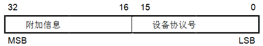
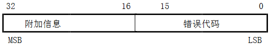
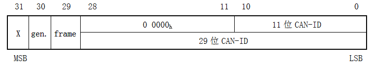
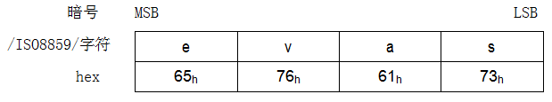
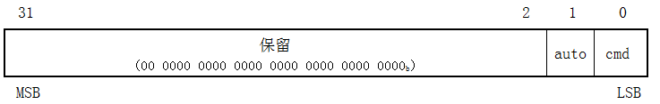
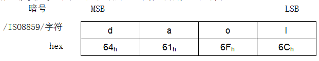
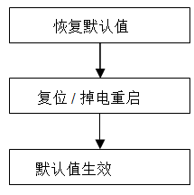
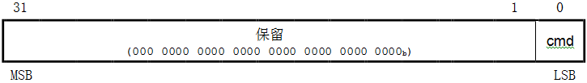
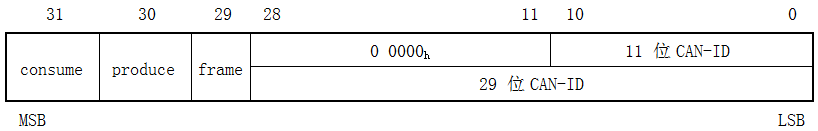
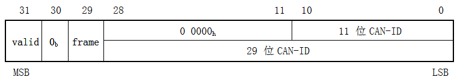

##7.5 **通信协议规范**
###7.5.1 **对象及其条目说明规范**
对象字典对象的条目结构描述遵守以下方式：所有设备协议、接口协议和应用协议都基于通信协议所使用的对象及其条目说明规则，见表52和表53。

表52：对象描述格式

**对象描述**

|索引|协议定义的索引号|
|---|---|
|名称|参数名称|
|对象代码|变量的分类|
|数据类型|数据类型分类|
|类别|可选的或强制性的区分|
对象代码是表52描述的对象定义的成员。考虑可读性，对象描述要附带对象的名称。

表53：对象值的描述格式

**条目说明**

|子索引|子项编号|
|---|---|
|描述|描述子索引名称(字段只用于数组、记录和结构)|
|数据类型|数据类型分类(字段只用于记录和结构)|
|条目类别|表明对象条目是可选、强制还是条件的|
|访问权限|只读(ro)或读/写(rw)或只写(wo)|
|PDO映射|如果该对象可映射至PDO则定义该项。说明： 可选：对象可以映射到PDO 默认值：对象是默认映射的一部分(请参见设备协议或应用协议) TPDO：对象可被映射到TPDO不应被映射到RPDO RPDO：对象可被映射到RPDO不应该映射到TPDO 无：对象不应映射到PDO|
|取值范围|可能的取值范围，或数据类型的全部取值范围|
|默认值|无：无默认值 协议指定：由协议指定默认值 造商指定：默认值由CANopen设备制造商指定 值：CANopen设备初始化后的默认值|
简单的变量带有值定义即可，无须格外的条目类别定义。复合数据类型其值定义应包括每个元素(子索引)。
###7.5.2 **通信协议对象的详细规范**
####7.5.2.1 **对象1000h：设备类型**
此对象提供有关设备类型的信息。该对象描述了逻辑设备类型及其功能。它由两个16位域组成，一个描述所用设备协议或应用协议，另一个给出逻辑设备的附加功能信息。附加的信息参数为设备协议和应用协议所指定。其说明不属于本文范围，定义于相应的设备协议和应用协议。  
**值定义**  
该值为0000h表示逻辑设备不遵守标准设备协议。在这种情况下附加的信息应为0000h(如果没有更多的逻辑设备)或FFFFh(如果还有其它逻辑设备)。  
多逻辑设备其附加信息应为FFFFh且其设备协议应为对象字典中第一逻辑设备。所有其他逻辑设备模块的协议标识于对象67FFh + x \* 800h且x = 逻辑设备内部编号(从1到8)减去1。这些对象将描述逻辑设备的设备类型，与对象1000h具有相同的值定义。  

图52：设备类型参数结构  
**对象描述**

|索引|1000h|
|---|---|
|名称|设备类型|
|对象代码|VAR|
|数据类型|UNSIGNED32|
|类别|强制|

**条目说明**  

|子索引|00h|
|---|---|
|访问权限|ro|
|PDO 映射|否|
|取值范围|请参阅*值定义*|
|默认值|协议或制造商指定|
####7.5.2.2 **对象1001h：错误寄存器**
此对象提供错误信息记录，CANopen设备将内部错误记录映射到该对象，此为应急对象的一部分。  
**值定义**

表54：错误寄存器结构

|位|M/O|意义|
|---|---|---|
|0|M|通用错误|
|1|O|电流|
|2|O|电压|
|3|O|温度|
|4|O|通信错误(溢出、错误状态)|
|5|O|设备协议指定|
|6|O|保留(始终为0b)|
|7|O|制造商指定|
如果某一特定的错误发生相应位置1b。通用错误位是强制设备必须支持的，其它可选。任何错误产生都将置位通用错误。  
**对象描述**

|索引|1001h|
|---|---|
|名称|错误寄存器|
|对象代码|VAR|
|数据类型|UNSIGNED8|
|类别|强制|
 
**条目说明**

|子索引|00h|
|---|---|
|访问权限|ro|
|PDO 映射|可选|
|取值范围|请参阅值定义|
|默认值|无|
####7.5.2.3 **对象 1002h：制造商状态寄存器**
此对象为制造商提供一个常规状态寄存器。 本规范仅定义此对象大小和位置。  
**对象描述**

|索引|1002h|
|---|---|
|名称|制造商状态寄存器|
|对象代码|VAR|
|数据类型|UNSIGNED32|
|类别|可选|
**条目说明**

|子索引|00h|
|---|---|
|访问权限|ro|
|PDO 映射|可选|
|取值范围|UNSIGNED32|
|默认值|无|
####7.5.2.4 **对象1003h：预定义错误域**
此对象表达CANopen设备上产生的错误，由应急对象编入，并提供错误历史纪录。  
**值定义**  
* 该对象子索引00h为从01h开始的实际的错误记录数量。
        备注：如果无错误存在其子索引00h值为00h，读子索引01h将得到SDO中止消息(中止代码： 0800 0024h或0800 0000h)。
* 每个新的错误应储存在子索引01h，较旧的错误应依次下移。
* 写00h到子索引00h将删除整个错误历史记录(清空数组)。禁止写入非00h值，否则将得到中止信息(错误代码:0609 0030h)。
* 错误代码的类型为UNSIGNED32(见表26)，由16位错误代码和16位制造商指定的附加错误信息组成。错误代码位于低2字节(LSB)，附加信息位于高2字节(MSB)。支持此对象应至少包含两个条目，长度子索引00h和至少一个错误项01h。

图53：预定义错误域结构
 
**对象描述**

|索引1003h|
|---|---|
|名称|预定义错误域|
|对象代码|数组|
|数据类型|UNSIGNED32|
|类别|可选|
**条目说明**

|子索引|00h|
|---|---|
|描述|错误数|
|条目类别|强制|
|访问权限|rw|
|PDO 映射|否|
|取值范围|00h到FEh|
|默认值|00h|

|子索引|01h|
|---|---|
|描述|标准错误域|
|条目类别|强制|
|访问权限|ro|
|PDO 映射|否|
|取值范围|UNSIGNED32|
|默认值|无|

|子索引|02h到FEh|
|---|---|
|描述|标准错误域|
|条目类别|可选|
|访问权限|ro|
|PDO 映射|否|
|取值范围|UNSIGNED32|
|默认值|无|

####7.5.2.5 **对象1005h：COB-ID同步消息**
此对象为已配置的同步(SYNC)对象COB-ID。此外，它定义了 CANopen 设备是否生成同步。对象结构定义于图54和表55。
值定义  

图54：同步COB-ID结构

表55：同步COB-ID描述  

|**位(S)**|**值**|**描述**|
|---|---|---|
|x|x|无意义|
|gen.|0b 1b|所在CANopen设备不生成同步消息 CANopen设备生成同步消息|
|frame|0b 1b|11位CAN-ID有效(CAN标准帧) 29位CAN-ID有效(CAN扩展帧)|
|29位CAN-ID|x|29位扩展帧CAN-ID|
|11位CAN-ID|x|11位标准帧CAN-ID|
位29(frame)和位30(gen.)可以是静态的(不可更改)。如果CANopen设备不生成同步消息，试图设置30位(gen.)为1b将得到SDO中止应答(中止代码：0609 0030h)。如果CANopen设备仅支持标准帧，则试图置位29(frame)为1b将得到SDO中止应答(中止代码：0609 0030h)。设置位30至1b并且同步计数器的溢出值大于0，在计数器值复位为1时启动第一次SYNC消息。对象有效时(位 30 = 1b)不允许更改0~29位。  
**对象描述**

|索引|1005h|
|---|---|
|名称|同步COB-ID| 
|对象代码|VAR|
|数据类型|UNSIGNED32|
|类别|条件的 强制的，如果PDO通信支持基于同步方式|
**条目说明**

|子索引|00h|
|---|---|
|访问权限|rw const如果COB-ID不可更改|
|PDO 映射|否|
|取值范围|请参阅值定义|
|默认值|0000 0080h或8000 0080h|

####7.5.2.6 **对象1006h：通信循环周期**
此对象定义SYNC时间间隔。  
**值定义**  
单位$$\mu$$s。如果置0000 0000h则禁用SYNC。通过置值为非0000 0000h并且同步计数器的溢出值大于 0，在计数器值复位为1时启动第一次SYNC消息。  
SYNC将在值更新后一个通信循环周期内启动。  
**对象描述**

|索引|1006h|
|---|---|
|名称|通信循环周期|
|对象代码|VAR|
|数据类型|UNSIGNED32|
|类别|条件的 同步生产者为强制的|
**条目说明**

|子索引|00h|
|---|---|
|访问权限|rw|
|PDO 映射|否|
|值范围|UNSIGNED32|
|默认值|0000 0000h|
####7.5.2.7 **对象1007h：同步窗长度**
此对象表达PDOs同步窗长度配置。  
如果错过同步窗，所有的TPDOs将被丢弃并且会产生EMCY消息；所有的RPDOs也被丢弃直到下次同步消息的接收。同步RPDO处理在下一个同步消息到来后恢复。  
**值定义**  
单位$$\mu$$s。如果置0000 0000h，同步窗将被禁用。  
**对象描述**

|索引|1007h|
|---|---|
|名称|同步窗长度|
|对象代码|VAR|
|数据类型|UNSIGNED32|
|类别|可选的|
 
**条目说明**

|子索引|00h|
|---|---|
|访问权限|rw|
|PDO映射|否|
|值范围|UNSIGNED32|
|默认值|0000 0000h|

####7.5.2.8 **对象1008h：制造商设备名称**
此对象为制造商的设备命名。  
**对象描述**

|索引|1008h|
|---|---|
|名称|制造商设备名称|
|对象代码|VAR|
|数据类型|VISIBLE_STRING|
|类别|可选|
**条目说明**

|子索引|00h|
|---|---|
|访问权限|const|
|PDO映射|否|
|取值范围|VISIBLE_STRING|
|默认值|制造商指定|
####7.5.2.9 **对象1009h：制造商的硬件版本**
此对象为制造商提供的硬件版本。  
**对象描述**

|索引号|1009h|
|---|---|
|名称|制造商硬件版本|
|对象代码|VAR|
|数据类型|VISIBLE_STRING|
|类别|可选|
**条目说明**

|子索引|00h|
|---|---|
|访问权限|const|
|PDO 映射|No|
|取值范围|VISIBLE_STRING|
|默认值|制造商指定|
####7.5.2.11 **对象100Ch：监护周期**
索引对象100Ch和100Dh是生存周期因子，前者配置了监护周期。其乘积给出了生存监护协议的生存周期。  
**值定义**  
单位ms。值为 0000h时禁用生存监护。  
**对象描述**

|索引|100Ch|
|---|---|
|名称|监护周期|
|对象代码|VAR|
|数据类型|UNSIGNED16|
|类别|条件的 如果支持节点保护则为强制的|
**条目说明**

|子索引|00h|
|---|---|
|访问权限|rw ro，如果不支持寿命保护|
|PDO 映射|否|
|值范围|UNSIGNED16|
|默认值|0000h|
####7.5.2.12 **对象100Dh：生存周期因子**
生存周期因子和监护周期的乘积给出了生存监护协仪的生存周期。  
**值定义**  
该值为00h应禁用生存监护。  
**对象描述**

|索引|100Dh|
|---|---|
|名称|生存周期因子|
|对象代码|VAR|
|数据类型|UNSIGNED8|
|类别|条件的 如果支持节点监护，是强制性的|
**条目说明**

|子索引|00h|
|---|---|
|访问权限|rw \ro，如果不支持生存监护|
|PDO 映射|否|
|取值范围|UNSIGNED8|
|默认值|00h|
####7.5.2.13 **对象1010h：保存参数**
此对象控制保存参数到非易失性存储器中。  
**值定义**
为了访问 CANopen 设备，应提供相关信息的保存能力。  
参数组分类： 
* 子索引00h包含子索引数。
* 子索引01h指的是所有可存储在CANopen设备上的的参数。
* 子索引02h指的是通信相关的参数(索引从1000h到1FFFh)。
* 子索引03h指的是应用相关的参数(索引从6000h到9FFFh)。
* 子索引04h到7Fh制造商可选的单独的参数。
* 子索引80h到FEh为将来的使用而保留。

为了避免存储的参数错误，存储应仅当特定暗号写到相应的子索引才被执行。暗号必须是“save”：  

图55：存储权限暗号  
在相应子索引接收到正确的暗号后，CANopen设备保存参数然后通过SDO确认(SDO下载启动响应)。如果存储失败，CANopen设备响应SDO中止(中止代码：0606 0000h)。  
如果写入暗号有误，CANopen设备拒绝保存，并且响应SDO中止传输(中止代码：0800 002xh)。  
通过读访问，CANopen设备提供存储功能相关信息，格式如下：  

图56：读结构

表56：读访问结构

|**位**|**值**|**描述**|
|---|---|---|
|auto|0b 1b|CANopen设备不自动保存参数 CANopen设备自动保存参数|
|cmd|0b 1b|CANopen设备不接受保存参数命令 CANopen设备按命令执行保存参数动作|
自动保存意味着CANopen设备参数的非易失存储无需用户请求。  
**对象描述**

|索引|1010h|
|名称|存储参数|
|对象代码|ARRAY|
|数据类型|UNSIGNED32|
|类别|可选|
**条目说明**

|子索引|00h|
|---|---|
|描述|最高子索引数|
|条目类别|强制|
|访问权限|const|
|PDO 映射|否|
|取值范围|01h~7Fh|
|默认值|协议或制造商指定|

|子索引|01h|
|---|---|
|描述|保存所有参数|
|条目类别|强制|
|访问权限|rw ro，如果支持自动保存|
|PDO 映射|否|
|取值范围|请参阅*值定义* (图55为写入；图56为只读)|
|默认值|协议或制造商指定|
 
|子索引|02h|
|---|---|
|描述|保存的通信参数|
|条目类别|可选|
|访问权限|rw ro，如果支持自动保存|
|PDO映射|否|
|取值范围|请参阅*值定义* (图55为写入；图56为只读访问权限)|
|默认值|协议或制造商指定|

|子索引|03h|
|---|---|
|描述|保存应用参数|
|条目类别|可选|
|访问权限|rw ro，如果支持自动保存|
|PDO映射|否|
|取值范围|请参阅*值定义* (图55为写入；图56为只读访问权限)|
|默认值|协议或制造商指定|

|子索引|04h~7Fh|
|---|---|
|描述|保存制造商定义的参数|
|条目类别|可选|
|访问权限|rw ro，如果支持自动保存|
|PDO映射|否|
|取值范围|请参阅*值定义* (图55为写入；图56为只读访问权限)|
|默认值|协议或制造商指定|
####7.5.2.14 **对象1011h：恢复缺省参数**
通过该对象根据协议、设备协议和应用协议恢复参数默认值。  
**值定义**
通过读取访问，CANopen设备提供有关恢复相关值的功能信息。其参数组的分类：
* 子索引00h包含支持的最大子索引数。
* 子索引01h指恢复所有参数。
* 子索引02h指恢复通信相关参数(索引从1000h到1FFFh)。
* 子索引03h恢复应用相关参数(索引从6000h到9FFFh)。
* 子索引04h到7Fh为制造商指定的恢复特定参数。
* 子索引80h到FEh为将来的使用而保留。

为了避免误动作，恢复应仅当写入暗号到相应的子索引有效。暗号为“load”： 

图57：恢复默认值的写入暗号

CANopen设备接收到正确的暗号后就会恢复相应参数值为默认值，然后通过SDO应答确认(SDO下载启动应答)。如果恢复失败会得到SDO中止应答(中止代码：0606 0000h)。如果暗号写入错误，CANopen设备应拒绝恢复操作并应答SDO中止(中止代码：0800 002xh)。
CANopen设备复位(对于子索引01h到7Fh执行NMT复位节点服务，对于子索引02h需要执行NMT复位通信服务)或掉电重启后默认值生效。  

图58：恢复默认值过程

通过读访问，CANopen设备提供恢复参数功能相关信息，格式如下：  

图59：恢复默认的读访问结构

表57：恢复默认的读访问结构

|**位**|**值**|**描述**|
|---|---|
|cmd|0b 1b|CANopen设备不支持恢复默认参数  CANopen设备支持恢复参数|
**对象描述**

|索引|1011h|
|---|---|
|名称|恢复缺省参数|
|对象代码|ARRAY|
|数据类型|UNSIGNED32|
|类别|可选|

|子索引|00h|
|---|---|
|描述|最高子索引数|
|条目类别|强制|
|访问权限|const|
|PDO映射|否|
|取值范围|01h~7Fh|
|默认值|协议或制造商指定|

|子索引|01h|
|---|---|
|描述|恢复所有默认的参数|
|条目类别|强制|
|访问权限|rw|
|PDO 映射|否|
|取值范围|请参阅值定义 (图57为写访问；图59读访问)|
|默认值|协议或制造商指定|

|子索引|02h|
|---|---|
|描述|恢复默认的通信参数|
|条目类别|强制|
|访问权限|rw|
|PDO 映射|否|
|取值范围|请参阅值定义 (图57为写访问；图59读访问)|
|默认值|协议或制造商指定|

|子索引|03h|
|---|---|
|描述|恢复应用的默认参数|
|条目类别|强制|
|访问权限|rw|
|PDO 映射|否|
|取值范围|请参阅值定义 (图57为写访问；图59读访问)|
|默认值|协议或制造商指定|

|子索引|04h~7Fh|
|---|---|
|描述|还原制造商定义的默认参数|
|条目类别|可选|
|访问权限|rw|
|PDO 映射|否|
|取值范围|请参阅值定义 (图57为写访问；图59读访问)|
|默认值|协议或制造商指定| 
####7.5.2.15 **对象1012h：时间戳对象COB-ID**
此对象为时间戳对象(TIME)的COB-ID配置。此外，它还定义了CANopen设备是否消费TIME或是否生成TIME。对象结构见图60和表58。  
**值定义**

图60：TIME COB-ID结构

表58：TIME COB-ID说明
|**位(们)**|**值**|**描述**|
|consume|0b 1b|CANopen设备不消费TIME消息 CANopen设备消费TIME消息|
|produce|0b 1b|CANopen设备不会产生TIME消息  CANopen设备产生TIME消息|
|frame|0b 1b|11位CAN-ID有效(CAN标准帧) 29位CAN-ID有效(CAN扩展帧)|
|29位CAN-ID|x|29位CAN-ID的扩展帧|
|11位CAN-ID|x|11位CAN-ID 的标准帧|
位29(frame)、30(produce)可以是静态的(不能更改)。如果CANopen设备不支持生成TIME，试图置位30(produce)为1b将得到SDO中止传输应答(中止代码：0609 0030h)。如果CANopen设备仅支持标准帧，试图置位29(frame)1b得到SDO中止传输应答(中止代码：0609 0030h)。当此对象存在(位30=1b或位31=1b)时位0至29不可更改。  
**对象描述**

|索引|1012h|
|---|---|
|名称|时间戳COB-ID|
|对象代码|VAR|
|数据类型|UNSIGNED32|
|类别|可选的|

|子索引|00h|
|---|---|
|访问权限|rw|
|PDO 映射|否|
|取值范围|UNSIGNED32|
|默认值|CAN-ID：100h frame：0b 有效：协议或制造商指定|

####7.5.2.16 **对象1013h：高分辨率时间戳**
此对象表达已配置的高分辨率时间戳。它可能会被映射到PDO，以交换高分辨率时间戳的消息。鼓励更深入的应用。  
**值定义**  
单位$$\mu$$s。  
**对象描述**

|索引|1013h|
|---|---|
|名称|高分辨率时间戳|
|对象代码|VAR|
|数据类型|UNSIGNED32|
|类别|可选|
**条目说明**

|子索引|00h|
|---|---|
|访问权限|rw ro，如果仅支持生成高分辨率时间戳 rw或wo，如果仅支持高分辨率时间戳消费|
|PDO映射|可选|
|取值范围|UNSIGNED32|
|默认值|0|
####7.5.2.17 **对象1014h：EMCY COB-ID**
此对象表达已配置的EMCY 写服务COB-ID。  
**值定义**

图61：EMCY标识结构
 

表59：EMCY COB-ID说明

|**位(们)**|**值**|**描述**|
|---|---|---|
|valid|0b 1b|EMCY存在/有效 EMCY不存在/无效|
|30|0b|保留(始终为0b)|
|frame|0b 1b|11CAN-ID有效(CAN标准帧) 29位CAN-ID有效(CAN扩展帧)|
|29位CAN-ID|x|29位CAN-ID的扩展帧|
|11位CAN-ID|x|11位CAN-ID的标准帧|

仅支持标准帧的CANopen设备企图置位29(frame)为1b将得到SDO中止传输响应(中止代码：0609 0030h)。当应急对象有效(位31= 0b)时，位0至29禁止更改。  
**对象描述**

|索引|1014h|
|---|---|
|名称|应急消息COB-ID|
|对象代码|VAR|
|数据类型|UNSIGNED32|
|类别|条件的 强制性的，如果支持应急对象|
**条目说明**

|子索引|00h|
|---|---|
|访问权限|rw const如果COB-ID不可更改|
|PDO映射|否|
|取值范围|UNSIGNED32|
|默认值|CAN-ID：80h+Node-ID frame：0b valid：协议或制造商指定|

